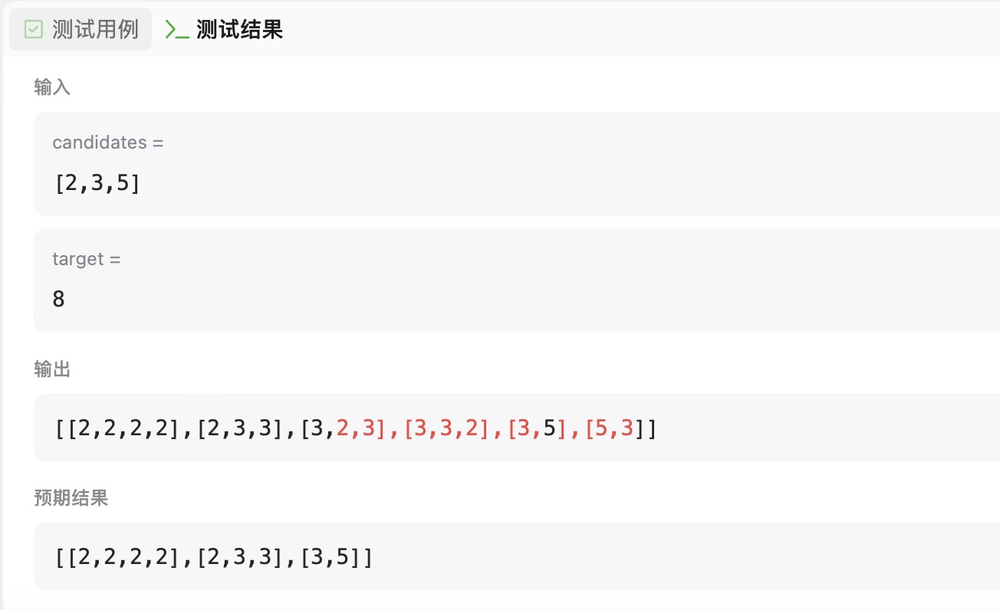
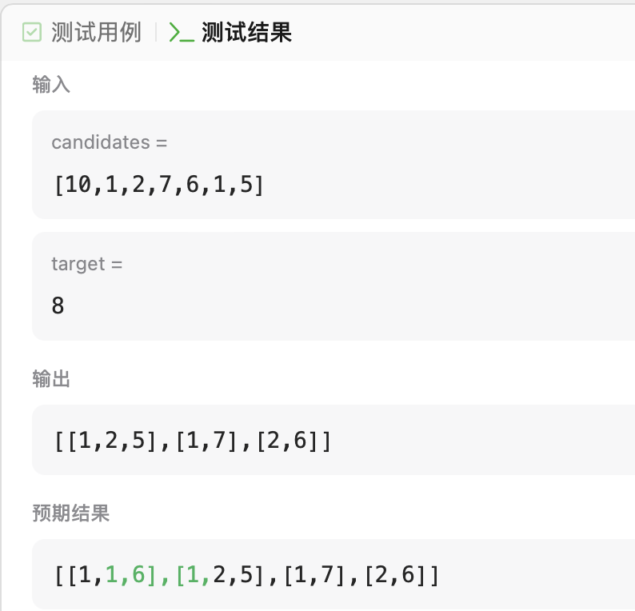
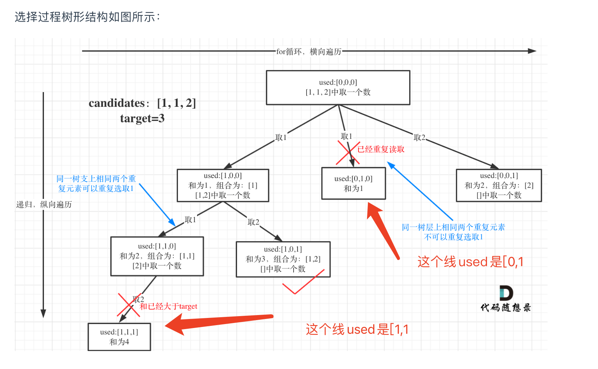

# 回溯算法

理解为用来解决可以被抽象为N叉树，每层递归是N叉树向下一层。

回溯本质就是暴力解。

需要决定的问题：

1.递归出口，既如何判返回

2.单层遍历，保存选中的节点值

3.循环中递归调用向下一层，以及调用之后的pop掉本层的值

4.是否可剪枝，即单层for循环的边界条件是否可以缩小


## 相关题目

### 组合类问题

####  77.组合

https://leetcode.cn/problems/combinations/description/

最典型的回溯

```swift
func combine(_ n: Int, _ k: Int) -> [[Int]] {
    var ans:[[Int]] = []
    var arr:[Int] = []
    func backtracking(_ start:Int) {
        if arr.count == k {
            ans.append(arr)
            return
        }
        for i in start ...  n - (k - arr.count) + 1 {
            arr.append(i)
            backtracking(i + 1)
            arr.removeLast()
        }
    }
    var combineArray:[Int] = []
    backtracking(1)
    return ans
}
```


#### 39.组合总和Ⅰ

https://leetcode.cn/problems/combination-sum/description/

和组合的区别是每次递归都是扫数组中所有的数

然后进下层前，判断数组当前和是否小于target

问题在于，去重。


当我第一次写完之后：

```swift
func combinationSum(_ candidates: [Int], _ target: Int) -> [[Int]] {
    var ans:[[Int]] = []
    var arr:[Int] = []

    func backtracking() {
        var sum = 0
        arr.map{ sum += $0 }
        if sum == target {
            ans.append(arr)
            return
        }
        for i in candidates {
            if sum + i <= target {
                arr.append(i)
                backtracking()
                arr.removeLast()
            }
        }
    }
    backtracking()
    return ans
}
```

执行结果是排列而不是组合：



不可能是保存结果时，对结果数组中每个数组遍历，与当前结果判重的暴力解.

没想出来，跑去看题解了：

<b>关键在于，进下一层时不能扫所有的数，例如当前选的是第index个数组，只能扫[index... maxIndex]子集</b>

例如[2,3,5] target = 4 的场景，第一个支是2，2下一层会扫[2,3,5]，下一层拿到的是[2,2] [2,3] [2,5]

第二个支是3，如果3继续扫整个数组，会得到[3,2] [3,3] [3,5].

第三个支5，得到[5,2] [5,3] [5,5]

得到的了A3,2的所有排列

如果要得到组合，第二支3扫描时，就不能拿前面的2的，5就不能拿前面的2，3了。

或者换个思路，想一想选择排序j什么从i+1开始就理解了。

```swift
func combinationSum(_ candidates: [Int], _ target: Int) -> [[Int]] {
    var ans:[[Int]] = []
    var arr:[Int] = []

    func backtracking(_ start:Int) {
        var sum = 0
        arr.map{ sum += $0 }
        if sum == target {
            ans.append(arr)
            return
        }
        for i in start ..< candidates.count {
            let val = candidates[i]
            if sum + val <= target {
                arr.append(val)
                backtracking(i)
                arr.removeLast()
            }
        }
    }
    backtracking(0)
    return ans
}
```

#### 40.组合总和Ⅱ

于组合总和的区别是，组合总和中数组元素不重复，且每个元素可以重复选取

组合总和Ⅱ中，组合数组元素可以重复，且每个元素只能取一次（即向下开一层时候从startIndex+1开始）

问题在于解集不可以包含重复组合，如何去重，即如何对每层不同支去重。


第一次做时候想法是原始数组排序，然后再每层的for循环中判断，当前第i元素是否与前一个i-1元素值相同，相同则直接剪枝：

```swift
func combinationSum2(_ candidates: [Int], _ target: Int) -> [[Int]] {
    var ans:[[Int]] = []
    let sorted = candidates.sorted()

    var arr:[Int] = []
    var sum = 0

    func backtracking(_ start:Int) {
        if sum == target {
            ans.append(arr)
            return
        }
        for i in start ..< sorted.count {
            let val = sorted[i]
            if i > 0 && sorted[i] == sorted[i - 1] {
                continue
            }
            if sum + val <= target {
                arr.append(val)
                sum += val
                backtracking(i + 1)

                arr.removeLast()
                sum -= val
            }
        }
    }
    backtracking(0)
    return ans
}
```

这样会导致错误的剪掉本来应该保留的枝：



例如[10,1,2,7,6,1,5]排序后[1,1,2,5,6,7,10]。

第一层选1后，第二层选第二个1时，由于index=1，且与index=0的元素相同，也被剪掉了。

问题在于如何只剪掉层中相同的枝？

想不出来，看答案了…

建立了一个used数组，保存选中状态。如[1,1,2] target=3的用例中，建立used = [0,0,0]:


```swift
func combinationSum2(_ candidates: [Int], _ target: Int) -> [[Int]] {
    var ans:[[Int]] = []
    let sorted = candidates.sorted()

    var arr:[Int] = []
    var sum = 0
    var visited = Array(repeating:0, count: sorted.count)

    func backtracking(_ start:Int) {
        if sum == target {
            ans.append(arr)
            return
        }
        for i in start ..< sorted.count {
            let val = sorted[i]
            if i > 0 && sorted[i] == sorted[i - 1] && visited[i - 1] == 0 {
                continue
            }
            if sum + val <= target {
                arr.append(val)
                visited[i] = 1
                sum += val
                backtracking(i + 1)

                arr.removeLast()
                visited[i] = 0
                sum -= val
            }
        }
    }
    backtracking(0)
    return ans
}
```

#### 41.组合总和III

这个没什么特殊的，收集结果的时候判断下层熟==k，以及开一层前判断层数是否再k之内。

第一次没跑过是因为开循环前需要判断下start是否超过9.

```swift
func combinationSum3(_ k: Int, _ n: Int) -> [[Int]] {
    var ans:[[Int]] = []
    var arr:[Int] = []
    var sum = 0

    func backtracking(_ start:Int, _ level: Int) {
        if sum == n  {
            if arr.count == k {ans.append(arr)}
            return
        }else if sum > n {
            return
        }else {
            if level <= k {
                if start > 9 {return}
                for i in start ... 9 {
                    if sum + i <= n {
                        arr.append(i)
                        sum += i
                        backtracking(i + 1, level + 1)
                        arr.removeLast()
                        sum -= i
                    }
                }
            }
        }
    }
    backtracking(1,1)
    return ans
}
```

看了下答案，我的终止条件写的和他们不一样，他们是判断level是否等于k。我是判断sum大于等于n…